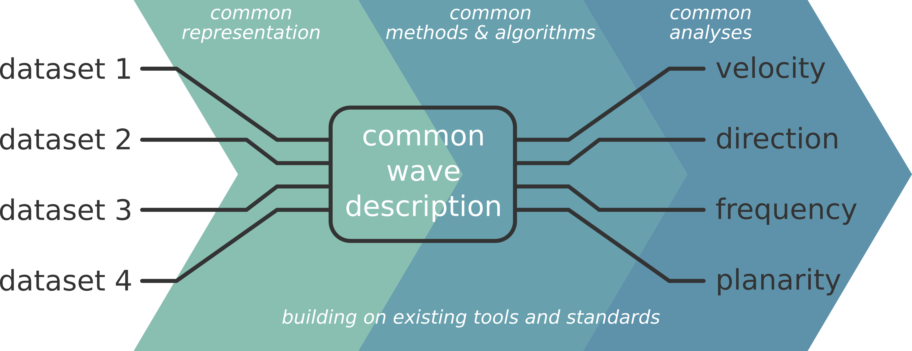

=====================================================
Collaborative Brain Wave Analysis Pipeline (Cobrawap)
=====================================================

|logo| This repository aims at developing adaptable and reusable analysis pipelines for a multi-scale, multi-methodology analysis of cortical wave activity.

.. |logo| image:: doc/images/cobrawap_logo.png
            :height: 150px
            :alt: Cobrawap Logo
            :align: middle

..     :widths: auto

..     * - .. figure:: doc/images/cobrawap_logo.png
..             :height: 150px
..             :alt: Cobrawap Logo
..             :align: left

..       - This repository aims at developing adaptable and reusable analysis pipelines for a multi-scale, multi-methodology analysis of cortical wave activity.

`Link to pipeline README <https://github.com/INM-6/cobrawap/tree/master/pipeline>`_ | `Link to introductive video <https://www.youtube.com/watch?v=1Qf4zIzV9ow&list=PLvAS8zldX4Ci5uG9NsWv5Kl4Zx2UtWQPh&index=13>`_ | `Link to Ebrains Collaboratory <https://wiki.ebrains.eu/bin/view/Collabs/slow-wave-analysis-pipeline/>`_

Concept
=======

For researchers to be able to effectively reproduce results and build on each other's progress, it is important to not only make results openly accessible and to facilitate data sharing but also to build the analysis workflows in a shareable and reusable manner.

Making analysis scripts available alongside results and datasets is good. What is even better is to design the analysis workflows in a manner that they are general and flexible enough so that they can be reused in further research. Within the rich diversity of analyses there is no one-size-fit-all solution for this. However, there is a lot of existing work that can help with the challenges of developing a general, adaptable, reusable analysis pipeline.

Here, we work to bring together existing analysis methods, tools, and data standards and interfacing them in the shape of a pipeline for the analysis and characterization of cortical wave-like activity and UP/DOWN state detection. This work should serve both as a template for building reusable analysis pipelines in general, as well as a space to gather the various data types exhibiting wave activity and their various analysis approaches into the same pipeline. Besides generating easily reproducible and curated results, such a pipeline promises to facilitate a rigorous comparison between datasets, model validation, and method benchmarking.

The current prototype includes
------------------------------
* a hierarchical and modular pipeline framework based on the Snakemake_ workflow management tool
* reusable method implementations (blocks and stages) for standalone applications or integration into workflows
* analysis methods for electrophysiological and optical data on the characterization of cortical wave activity and local oscillations
* visualization of the analysis steps and the intermediate results
* intermediate results curated with annotated metadata
* guides for execution locally and on the collab

.. _Snakemake: https://snakemake.readthedocs.io/en/stable/

For further developments and feature requests refer to the `Github Issues <https://github.com/INM-6/cobrawap/issues>_`.

Citation
========
Please cite our preprint if you use Cobrawap or its components in your work, and add the Research Resource Identifier: *RRID:SCR_022966*

* Gutzen, R., De Bonis, G., De Luca, C., Pastorelli, E., Capone, C., Allegra Mascaro, A. L., Resta, F., Manasanch, A., Pavone, F. S., Sanchez-Vives, M. V., Mattia, M., Grün, S., Paolucci, P. S., & Denker, M. (2022). *Comparing apples to apples—Using a modular and adaptable analysis pipeline to compare slow cerebral rhythms across heterogeneous datasets* (arXiv:2211.08527). arXiv. `https://doi.org/10.48550/arXiv.2211.08527 <https://doi.org/10.48550/arXiv.2211.08527>`_

License
=======
The Collaborative Brain Wave Analysis Pipeline (Cobrawap) project is open-source software and is licensed under the GNU General Public License v3 or later.

Involved partners
=================
This collaboration was originally started by HBP-SGA2-(WP3.2 and WP5.7) and extended to other HBP members and partners as SP3 UseCase002.

- **Forschungszentrum Jülich, Germany:** Robin Gutzen, Michael Denker

- **Istituto Nazionale di Fisica Nucleare (INFN), Roma, Italy:** Giulia De Bonis, Pier Stanislao Paolucci, Elena Pastorelli, Francesco Simula, Cristiano Capone, Chiara De Luca, Cosimo Lupo, Irene Bernava

- **Istituto Superiore di Sanità (ISS), Roma, Italy:** Maurizio Mattia, Antonio Pazienti.

- **Institut d’Investigacions Biomediques August Pi i Sunyer (IDIBAPS), Barcelona, Spain:** Arnau Manasanch, Miguel Dasilva, Maria V. Sanchez-Vives.

- **European Laboratory for Non-Linear Spectroscopy (LENS), Firenze, Italy:** Anna Letizia Allegra Mascaro, Francesco Resta, Francesco Pavone.

- **University of Milano (UniMi), Italy:** Andrea Pigorini, Thierry Nieus, Marcello Massimini

- **Unité de Neurosciences, Neuroinformatics Group, CNRS, France:** Andrew Davison

Further Context
===============

WaveScalES
----------
Sleep is present in all animal species notwithstanding the risk associated with the disconnection from the environment (e.g. predation) and the reduction of time available for food search and reproduction. Indeed, it is known that the human brains need healthy sleep, as chronic sleep deprivation reduces cognitive performances.
The goal of WaveScalES_ (description at the date 2019-03-31, SGA2-M12) is to unveil the underlying mechanisms of deep sleep, anesthesia and coma, the emergence toward wakefulness, and the link between sleep and learning, taking advantage of cortical slow wave activity (SWA) and investigating it with experimental data, analysis tools, modulation techniques, theoretical models and simulations of such states and of the transition to wakefulness. The resources of Wavescales are aimed to be made accessible via the EBRAINS_ resources including analysis tools (e.g., Elephant), simulation engines (e.g., NEST), and storage capacities (e.g., Knowledge Graph).

.. _WaveScalES: https://drive.google.com/file/d/1BYZmhz_qJ8MKPOIeyTZw6zjqfVMcCCCk/view
.. _EBRAINS: https://ebrains.eu/

Elephant & Neo
--------------
Neuroscience research is very diverse in its approaches, measurement modalities, and analysis methods. However, the scale and complexity of modern challenges in the field require a large degree of collaboration and thus the ability for easy data and tool sharing.

The goal of Neo_ is to improve interoperability between Python tools for analyzing, visualizing, and generating electrophysiology data, by providing a common, shared object model. The Neo data format provides a hierarchical data and metadata description for a variety of data types including intracellular and extracellular electrophysiology electrical data with support for multi-electrodes as well as optical recordings. Furthermore, it supports a wide range of neurophysiology file formats and can thus read data from most common recording devices.

The Electrophysiology Analysis Toolkit, Elephant_, is an open-source Python library for analysis methods. It focuses on providing fast and reliable implementations for generic analysis functions for spike train data and time series recordings from electrodes. As community centered project Elephant aims to serve as a common platform for analysis codes from different laboratories, and a consistent and homogeneous analysis framework.

.. _Neo: https://github.com/NeuralEnsemble/python-neo
.. _Elephant: https://github.com/NeuralEnsemble/elephant
