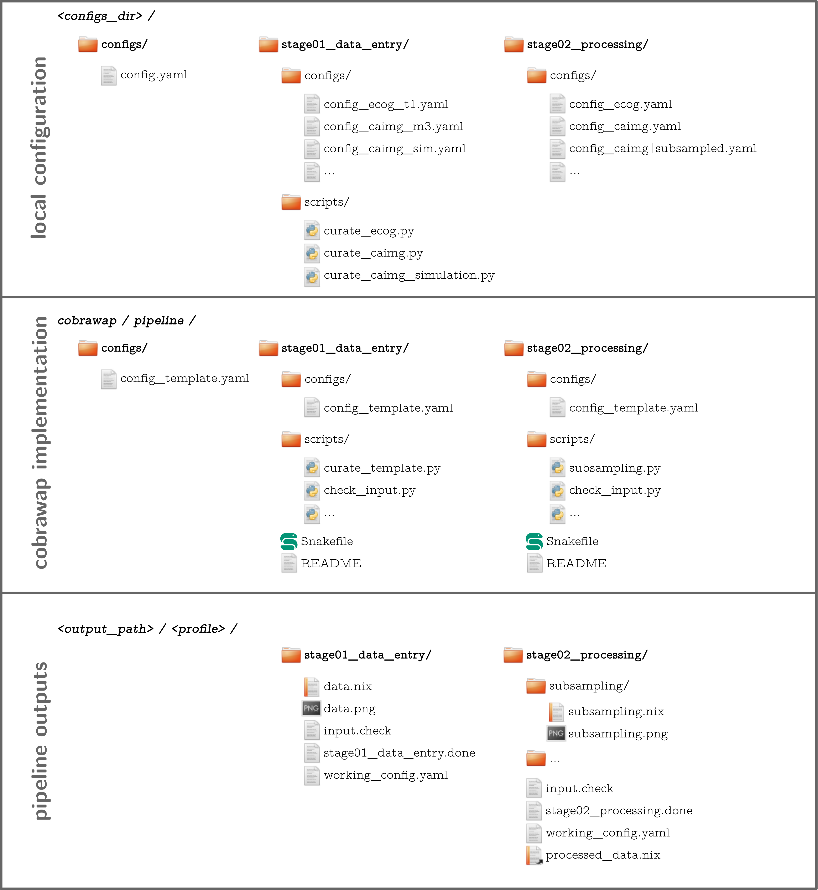

===============
Getting Started
===============

Modular Pipeline Approach
=========================
The design of the pipeline aims at interfacing a variety of general and specific analysis and processing steps in a flexible modular manner. Hence, the pipeline is able to adapt to diverse types of data (e.g., electrical ECoG, or optical Calcium Imaging recordings) and to different analysis questions. This makes the analyses a) more reproducible and b) comparable among each other since they rely on the same stack of algorithms and any differences in the processing are fully transparent.
The individual processing and analysis steps, **Blocks**, are organized in sequential **Stages**. Following along the stages, the analysis becomes more specific but also allows to branch off at after any stage, as each stage yields useful intermediate results and is autonomous so that it can be reused and recombined. Within each stage, there is a collection of blocks from which the user can select and arrange the analysis via a config file. Thus, the pipeline can be thought of as a curated database of methods on which an analysis can be constructed by drawing a path along the blocks and stages.

.. figure:: ../doc/images/pipeline_illustration.png
  :alt: Pipeline Structure

**Figure: Pipeline Structure.** *Each column represents a stage and each bullet represents a block. The green and blue markings indicate a exemplary block selections for a ECoG and a calcium imaging dataset.*

Installation
============
Currently, the recommended way to use Cobrawap is to get it directly from the `Github repository <https://github.com/INM-6/cobrawap>`_, cloning, forking, or adding it as submodule to another project repository.

*Other install options and online execution via* `EBRAINS <https://ebrains.eu/>`_ *will follow.*

Getting The Repository
======================
You can either clone cobrawap directly to your local machine,

.. code-block:: bash
  
    git clone git@github.com:INM-6/cobrawap.git

or fork it to your own Github space, to be able to make version-controlled changes to the pipeline implementation.

.. code-block:: bash

    git clone git@github.com:<your-github-handle>/cobrawap.git

However, idenpendently of whether you are working with the origin or a forked version, we recommend to add the Cobrawap repository as a `submodule <https://github.blog/2016-02-01-working-with-submodules/>`_ to the project repository in which it the pipeline (or pipeline components) are employed and configured.

.. code-block:: bash

    cd <your-wave-analysis-project>
    git submodule add git@github.com:<your-github-handle>/cobrawap.git

Creating The Environment
========================
The required Python packages are defined in the ``environment.yaml`` file. 
We suggest using `conda <https://docs.conda.io/en/latest/>`_ for the environment management.

.. code-block:: bash

    conda env create --file environment.yaml
    conda activate cobrawap

Setting Up The Pipeline
=======================
To set up the pipeline for use you first need to set your path information in ``cobrawap/settings_template.py`` and rename it to *`settings.py`*.
Then you need to set up the pipeline and stage configuration from the respective *`config_template.yaml`* files, by editing and renaming them to *`config.yaml`*, either within the cobrawap folder or a config separate folder (`configs_dir` in *`settings.py`*). Details on the pipeline configuration can be found below.

In particular, you need to configure entry of your dataset into pipeline, by editing the stage01 config file and setting the path to the dataset, as well as providing a script to load the data and putting it into the required neo representation. There a template files for the config and loading script, and a detailed guide to set up the data entry can be found in the `stage01 README <https://github.com/INM-6/cobrawap/blob/master/pipeline/stage01_data_entry/README.md>`_.

Pipeline Organisation
=====================
* ``Snakefile`` defines how the stages are executed within the full pipeline
* ``configs/``
  * ``config.yaml`` defines the global parameter settings
* ``settings.py`` defines the ``output_path`` and ``configs_dir``
* ``scripts/`` contains general utility scripts
* ``stageXY/`` each stage is a separate folder
  * ``Snakefile`` defines the blocks (=rules) and organizes their interaction
  * ``scripts/`` contains the analysis and plotting scripts (~1 script per block)
  * ``configs/`` contains the parameter settings for this stage
    * ``config_{profile}.yaml`` ... with different settings for different profiles
  * ``README`` describes the stage's functionality

**Figure: Folder Structure.** *The pipeline structure is reflected in the organization of the folders, here showing an excerpt of two stages and example blocks. Stages and blocks are folders and subfolders in the pipeline directory (middle row); the output of individual stages and blocks is stored with the same hierarchy of folders and subfolders (bottom row); the local configuration can act as an overlay to define config files and loading scripts (top row).*

Configuration
=============

Config Files
------------
There is one config file per stage, and one additional top-level config file that selects the stages and defines pipeline-wide parameters.
All config files are given as templates. So, in order to get started you need to copy/rename ``config_template.yaml`` to ``config.yaml`` in the corresponding folders, and edit to your needs.
See pipeline config template: |config template|_.

.. |config template| replace:: ``configs/config_template.yaml``
.. _config template: configs/config_template.yaml

Local Config Directory
----------------------
Similarly, you need to rename _`settings_template.py`_ to _`settings.py`_ and edit the containing `output_path` to fit your local system.
In the setting file, you can also optionally set a `configs_dir` path to define an alternative directory containing the config files. This alternative config directory mirrors the stage folder structure of the pipeline and can be used to configure the pipeline for specific projects without touching the cobrawap folder itself.

Config Profiles
---------------
Config profiles make it possible to group specific parameter configurations for different datasets or applications across stages, and easily switch between them. You can set the `PROFILE` parameter in the top-level config file (or via the command line when running the pipeline). The corresponding pipeline output will be stored in _`{output_path}/{profile}/`_, and for each stage the specific config file *`{stage}/configs/config_{profile}.yaml`* is used. 

To reduce redundancy and the number of config files, profiles use a hierachical naming convention where each subgroup is seperated with an underscore `_`, for example, `config_ecog_session1_trial7.yaml`. When a stage does not contain this exact file name, it falls back onto the parent group (`config_ecog_session1.yaml`) and when it also doesn't exist onto its parent group (`config_ecog.yaml`) and so on. Thus, config specialization is only applied in the stages where it is needed. Furthermore, you can add variants to the profile name with a `|` delimiter to additionally switch analysis types, for example, _`config_caimg_session1|subsampled.yaml`_.
The selection order is the following:

.. code-block:: bash

    config_some_profile|variant.yaml
    config_some|variant.yaml
    config|variant.yaml
    config_some_profile.yaml
    config_some.yaml
    config.yaml

Config Priority
---------------
[*stage config < pipeline config < command line config*]

Generally, all parameters are specified in the corresponding stage config files. However, any parameters can also be set in the top-level pipeline config. These then have priority and overwrite the values in all stages. This is useful, in particular, to specify the file formats (`NEO_FORMAT`, `PLOT_FORMAT`) and plotting parameters (`PLOT_TSTART`, `PLOT_TSTOP`, `PLOT_CHANNELS`). Additionally, you can set parameters via the command line when executing the pipeline with the flag `--config`. This is especially recommended for setting the profile (e.g. `--config PROFILE="ecog_session1_trial7|highbeta"`).

Execution
=========
Cobrawap relies on the functionality of Snakemake to execute the pipeline, and therefore supports its additional features and command line arguments (see its [documentation](https://snakemake.readthedocs.io/en/stable/executing/cli.html).

Running The Full Pipeline
-------------------------
Make sue all paths are set (_`settings.py`_) and the pipeline and stage configs are specified.
Then navigate to the _`cobrawap/pipeline/`_.
When `PROFILE` is set accordingly in the pipeline config, the execution is a simple snakemake call:

.. code-block:: bash

    snakemake --cores=1

Otherwise, the profile (and other parameters) can be set directly via the command line:

.. code-block:: bash

    snakemake --config PROFILE={profile} --cores=1

Running Specific Stages
-----------------------
Navigate to the stage folder _`cobrawap/pipeline/<stage>/`_. As each stage is a subworkflow it can be executed with the same snakemake calls as the full pipline. However, you need to manually specify the config file and stage input:

.. code-block:: bash

    snakemake --configfile='configs/config_{profile}.yaml' --config PROFILE={profile} STAGE_INPUT=/path/to/stage/input/file --cores=1

Running Specific Blocks
-----------------------
Each block is represented by a snakemake rule. To run a specific rule you can explicitly request its output file:

.. code-block:: bash

    snakemake /path/to/specific/file --configfile='configs/config_{profile}.yaml' --config PROFILE={profile} STAGE_INPUT=/path/to/stage/input/file --cores=1

Keep in mind that snakemake keeps track of the timestamps of scripts, input, and output files. So, a rule will only be run again if any of its inputs has changed, and if something in the creation of the input changed this might also trigger the re-execution of other blocks.

Pipeline Interfaces
===================
Pipeline Inputs
---------------

Pipeline Outputs
----------------

Stage Inputs
------------
The path to the input file for each stage is defined in the config parameter `STAGE_INPUT`. When executing the full pipeline the stage inputs are automatically set to the outputs (`STAGE_OUTPUT`) of the previous stage, respectively. Details on the input requirements for each stage are specified in the corresponding stage _`README`_ files and checked automatically via a *`check_input`* block in each stage.

Stage Outputs
-------------
The stage output file is stored as *`{output_path}/{profile}/{STAGE_NAME}/{STAGE_OUTPUT}/`*, with `STAGE_NAME`, and `STAGE_OUTPUT` taken from the corresponding config file and `output_path` from *`settings.py`*.
Details on the output content and format for each stage are specified in the corresponding stage *`README`* files.

Block Inputs
------------
Input dependencies to blocks are handled by the corresponding rule in the *Snakefile* and are arranged according on the mechanics of the respective stage.

Block Outputs
-------------
All output from blocks (data and figures) is stored in *`{output_path}/{profile}/{STAGE_NAME}/{block_name}/`*.

<!-- ## Reports
[*currently disabled because it creates performance issues on clusters*]

Reports are summaries (html page) about the execution of a Snakefile containing the rule execution order, run-time statistics, parameter configurations, and all plotting outputs tagged with `report()` in the Snakefile.

When the whole pipeline is executed, the reports for each stage are automatically created in *output_path/PROFILE/STAGE_NAME/report.html*.
To create a report for an individual stage, you can use the `report` flag.
`snakemake --configfile='configs/config_XY.yaml' --report /path/to/report.html`

Note that when using the option of setting `PLOT_CHANNELS` to `None` to plot a random channel, the report function might request a different plot than was previously created and will thus fail. -->

.. role:: bash(code)
   :language: bash